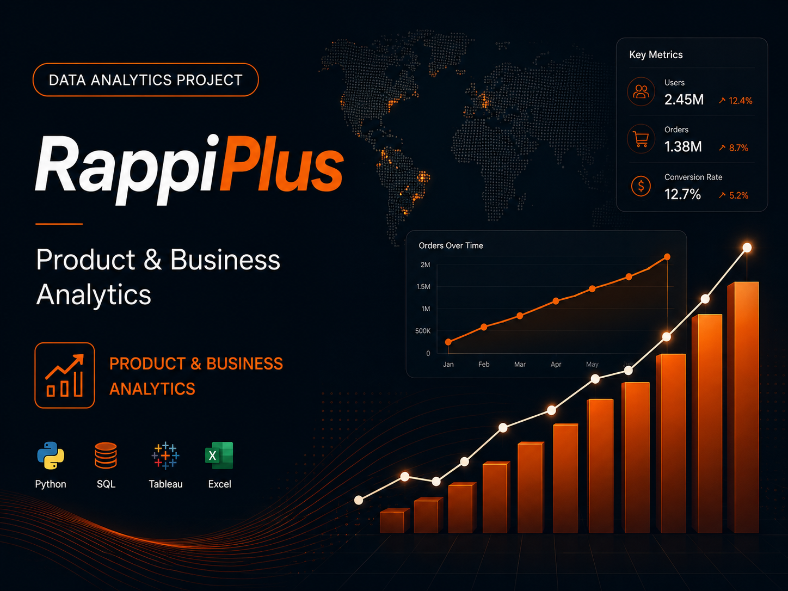
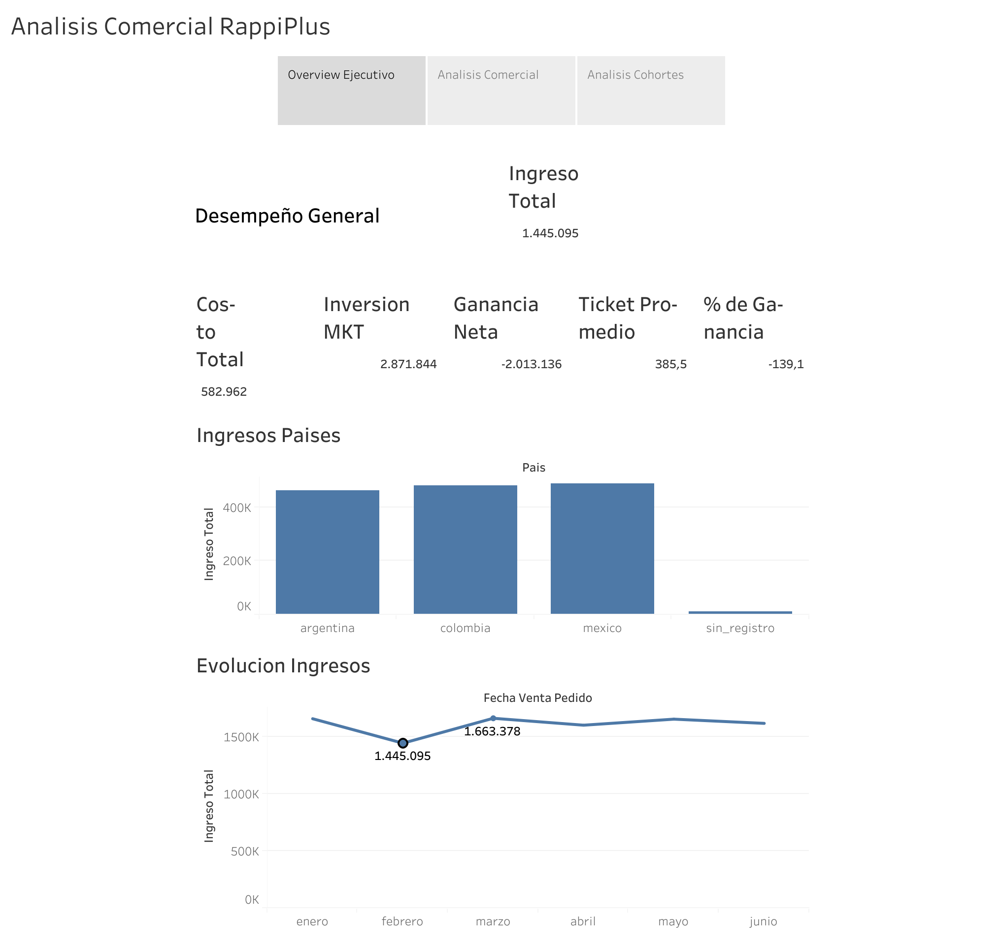
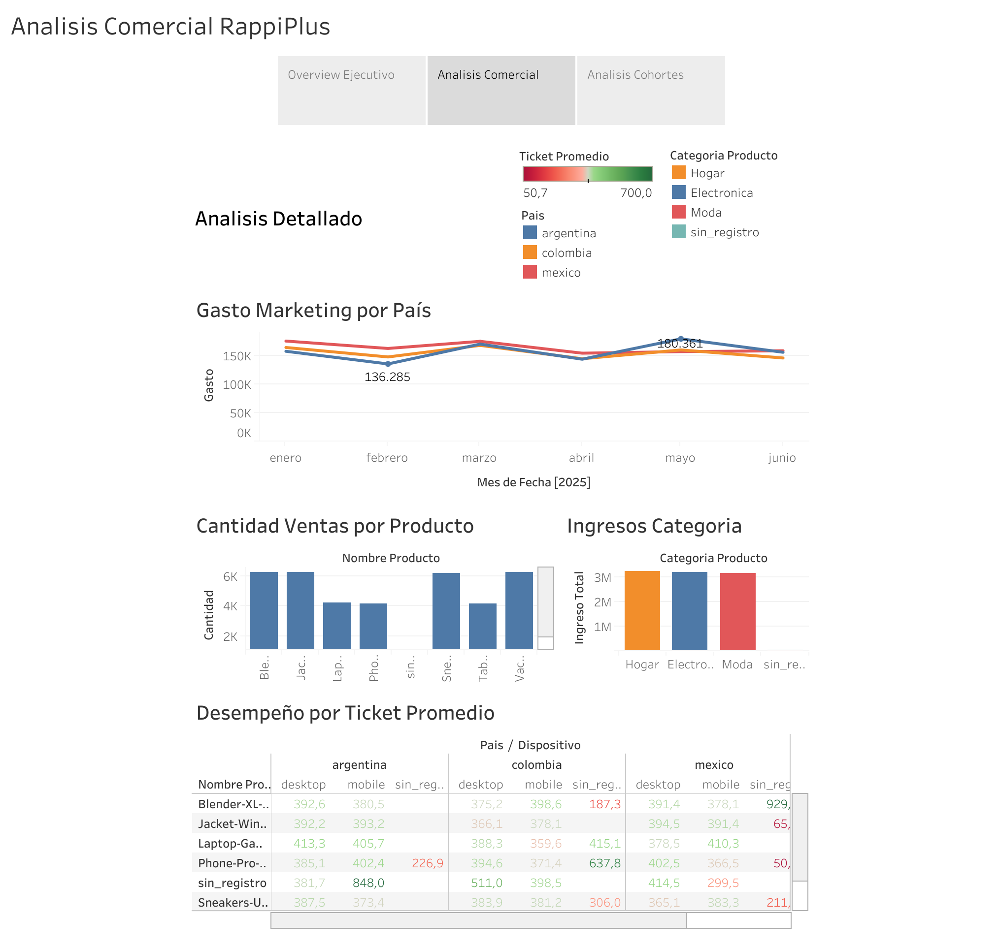
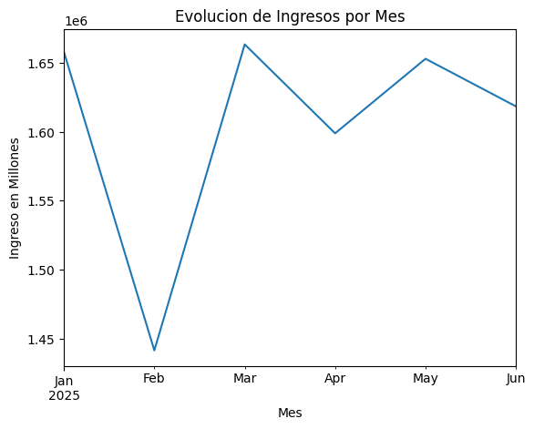
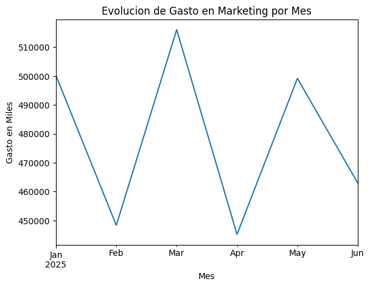

## Overview

RappiPlus is an end-to-end analytics project designed to evaluate business performance from multiple perspectives: **profitability, customer behavior, conversion, retention and experimentation**.

The goal was not simply to describe historical performance, but to connect different data sources and transform the results into insights that could support **growth, product and marketing decisions**.

The analysis combines **Python, SQL, funnel analysis, cohort analysis, A/B testing and data visualization** to build a comprehensive view of the business.

---

## Business Challenge

A digital platform can generate large amounts of transactional and behavioral data, but individual metrics rarely explain the full business picture.

The project was structured around several key questions:

- Is the business generating sustainable profitability?
- Where are users dropping out of the conversion funnel?
- How does customer retention evolve over time?
- Are there identifiable opportunities to improve conversion?
- Does a new checkout experience generate a statistically significant improvement?
- How can the findings be translated into actionable business recommendations?

---

## Data & Analytical Approach

The analysis integrates multiple datasets related to:

- Orders
- Products and catalog information
- Marketing activity
- User events
- Customer behavior
- Experimentation data

The workflow followed a structured analytical process:

1. Data extraction and validation
2. Data cleaning and transformation
3. Exploratory Data Analysis
4. Profitability analysis
5. Sales performance analysis
6. Conversion funnel analysis
7. Cohort and retention analysis
8. A/B test evaluation
9. Business interpretation
10. Strategic recommendations

---

## 01 — Profitability Analysis

The first stage focused on understanding the overall financial performance of the business.

### Key Results

- **Revenue analyzed:** approximately **$9.63M**
- **Operating costs:** approximately **$3.84M**
- **Marketing investment:** approximately **$2.87M**
- **Estimated net profit:** approximately **$2.92M**
- **Average Order Value:** approximately **$385.93**

These metrics provide a high-level view of the relationship between revenue generation, operating expenses and marketing investment.

### Business Interpretation

Revenue alone does not determine business performance.

By incorporating costs and marketing investment into the analysis, it becomes possible to evaluate whether commercial growth is also translating into sustainable profitability.

This provides a stronger foundation for decisions related to customer acquisition, marketing efficiency and resource allocation.

### Executive Dashboard

*Tableau executive view connecting revenue, cost, marketing investment, net profit, average ticket and revenue evolution.*

The dashboard provides a stakeholder-facing layer above the underlying analytical workflow, allowing the main commercial KPIs and performance trends to be reviewed in one place.

---

## 02 — Sales Performance

The transactional analysis was used to understand how customers were contributing to overall business performance.

Rather than focusing only on total sales, the analysis explored purchasing behavior and order-level performance to identify patterns that could influence commercial strategy.

The **Average Order Value of approximately $385.93** provides an important reference point for evaluating customer value and future opportunities related to segmentation, promotions and retention.

### Commercial Detail

*Detailed Tableau view combining marketing spend by country, product sales, category revenue and average-ticket performance.*

The notebook analysis complements the dashboard with exploratory visualizations such as monthly revenue and marketing-investment trends:

---

## 03 — Conversion Funnel

User behavior was analyzed across the conversion funnel to identify where the greatest friction occurred.

### Main Finding

The largest drop-off was detected between:

**Checkout → Payment**

with a drop-off of approximately:

**13.29%**

### Business Interpretation

This stage represents one of the clearest optimization opportunities identified in the analysis.

Users reaching checkout already demonstrate a relatively high level of purchase intent. Losing customers immediately before payment may indicate friction related to:

- Checkout experience
- Payment methods
- Technical performance
- Unexpected costs
- Trust signals
- Payment errors

### Recommendation

The checkout-to-payment stage should be prioritized for further investigation and experimentation.

Potential next steps include analyzing payment failures, segmenting abandonment by device or payment method, reviewing checkout UX and running targeted experiments to reduce friction.

---

## 04 — Cohort & Retention Analysis

Cohort analysis was used to evaluate how customer engagement and retention evolved over time.

Instead of analyzing the user base as a single group, customers were organized into cohorts to compare behavior across different acquisition periods.

### Why It Matters

Acquiring users is only one part of sustainable growth.

Understanding whether customers continue interacting with the platform after their initial experience provides important information about:

- Customer retention
- Product engagement
- Customer lifetime value
- Acquisition quality
- Long-term growth potential

The cohort analysis provides a foundation for identifying when engagement begins to decline and where retention strategies could have the greatest impact.

---

## 05 — A/B Testing

The project also evaluated an experiment comparing two checkout experiences.

### Experiment Results

**Variant A**

Conversion Rate: **15.69%**

**Variant B**

Conversion Rate: **16.29%**

At first glance, Variant B generated a slightly higher conversion rate.

However, statistical testing produced a **p-value of approximately 0.416**.

### Statistical Interpretation

Because the p-value is greater than the standard significance threshold of **0.05**, the observed difference is **not statistically significant**.

Therefore, there is not enough evidence to conclude that Variant B genuinely improves conversion.

### Business Recommendation

The experiment should **not justify a full rollout of Variant B based solely on the observed conversion difference**.

Possible next steps include:

- Increasing the sample size
- Extending the experiment duration
- Reviewing experiment segmentation
- Testing additional checkout improvements
- Evaluating secondary metrics before implementation

This prevents the business from making a product decision based on a difference that may simply be caused by random variation.

---

## Key Findings

The analysis highlighted several important business insights:

- The analyzed operation generated approximately **$9.63M in revenue** and an estimated **$2.92M in net profit**.
- Average Order Value was approximately **$385.93**.
- The largest funnel friction occurred between **checkout and payment**, with approximately **13.29% drop-off**.
- Retention analysis provided visibility into customer behavior across acquisition cohorts.
- Variant B showed a higher observed conversion rate than Variant A, but the difference was **not statistically significant**.
- The checkout and payment experience represents one of the clearest areas for further investigation and optimization.

---

## Business Recommendations

Based on the analysis, the main recommendations are:

### Optimize Checkout & Payment

Investigate the causes behind the checkout-to-payment drop-off and prioritize experiments designed to reduce friction at this stage.

### Strengthen Retention Analysis

Continue monitoring customer cohorts to identify the periods where engagement declines and develop targeted retention strategies.

### Evaluate Marketing Through Profitability

Marketing performance should be evaluated not only through acquisition volume, but also through customer value, conversion and profitability.

### Maintain Statistical Discipline

Avoid implementing product changes based only on small differences in conversion rates.

Experiments should reach sufficient statistical evidence before major decisions are made.

### Connect Product and Business Metrics

Funnel performance, retention, customer behavior and profitability should be analyzed together rather than as isolated KPIs.

---

## Tools & Technologies

- **Python**
- **Pandas**
- **NumPy**
- **SQL**
- **Exploratory Data Analysis**
- **Data Cleaning & Transformation**
- **Conversion Funnel Analysis**
- **Cohort Analysis**
- **A/B Testing**
- **Statistical Analysis**
- **Tableau**
- **Business Analytics**

---

## What This Project Demonstrates

This project demonstrates my ability to connect **technical analysis with business decision-making**.

Instead of stopping at descriptive metrics, I used multiple analytical approaches to investigate profitability, customer behavior, retention, conversion and experimentation.

The objective throughout the project was to answer three questions:

**What happened?**

**Why does it matter?**

**What should the business do next?**

That approach allows data to move beyond reporting and become a tool for **prioritization, experimentation and business growth**.

---

## Repository

<a href="https://github.com/josuemayoral-cell/Diagnostico_estrate-gico_integral_para_RappiPlus" target="_blank" rel="noopener noreferrer">
View RappiPlus Project on GitHub
</a>