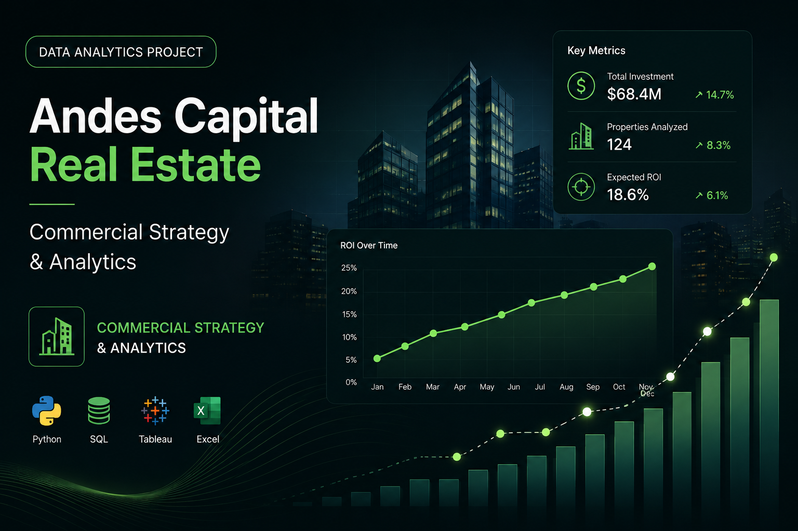

## Overview

Andes Capital Real Estate is a commercial analytics project focused on transforming sales and customer data into **strategic business decisions**.

The analysis evaluates revenue, sales performance, geographic markets, property categories, commercial channels, customer segments and repeat purchasing behavior.

The objective was to move beyond traditional reporting and answer a more important question:

**Where should the business focus its commercial efforts to generate sustainable growth?**

---

## Business Challenge

Commercial performance in real estate depends on multiple factors: location, property type, customer profile, sales channel and customer recurrence.

Analyzing these dimensions separately can hide important relationships.

This project was designed to answer questions such as:

- Which markets generate the highest commercial value?
- Which property categories drive revenue?
- Which sales channels contribute most to the business?
- Who are the highest-value customers?
- How important is repeat purchasing?
- When is customer churn most likely to occur?
- Where should commercial resources be prioritized?

---

## Data & Analytical Approach

The project uses a structured data model based on fact and dimension tables:

- Customer dimension
- Date dimension
- Property dimension
- Property sales fact table

This structure allowed commercial performance to be analyzed from multiple perspectives.

The analytical process included:

1. Data preparation and structuring
2. KPI development
3. Revenue and sales analysis
4. Geographic analysis
5. Property segmentation
6. Commercial channel analysis
7. Customer segmentation
8. Repeat purchase analysis
9. Cohort analysis
10. Strategic recommendations

The final results were visualized through **Tableau dashboards** designed to communicate the findings from a business perspective.

---

## 01 — Commercial Performance

The analyzed operation generated approximately:

**$6,012.5M in revenue**

across:

**8,500 sales**

The business also recorded:

**+11.14% year-over-year growth**

### Business Interpretation

The positive year-over-year performance indicates an existing growth foundation.

However, aggregate growth does not reveal which markets, customer segments or commercial channels are responsible for that performance.

The next stages of the analysis therefore focused on identifying where that value was concentrated.

---

## 02 — Geographic Performance

The geographic analysis identified **Bogotá** as the company's dominant market.

### Key Finding

**Bogotá accounts for approximately 54% of total revenue.**

### Business Interpretation

Bogotá represents the strongest commercial market in the analyzed operation.

At the same time, this level of concentration creates dependency on a single geographic market.

### Recommendation

Maintain Bogotá as a priority market while developing strategies to increase the contribution of secondary cities.

The objective should be to preserve performance in the strongest market while gradually creating a more diversified revenue base.

---

## 03 — Property Performance

Property-level analysis showed that **houses** were the highest-performing category.

### Key Finding

**Houses generated approximately $2.22B, representing 37% of total revenue.**

Commercial properties ranked second, followed by apartments.

### Business Interpretation

Residential houses represent a key revenue driver and can therefore receive greater attention in:

- Commercial campaigns
- Sales prioritization
- Customer targeting
- Inventory strategy
- Marketing investment

Secondary categories should continue to be evaluated for additional growth opportunities.

---

## 04 — Commercial Channel Analysis

One of the strongest patterns identified in the analysis was the concentration of revenue within a single sales channel.

### Key Finding

The **Broker channel generated approximately 73% of total revenue**, equivalent to approximately **$4.38B**.

### Business Interpretation

Broker performance demonstrates the importance of this channel to the current commercial model.

However, such a high concentration also creates dependency.

### Recommendation

Maintain Broker as a strategic channel while evaluating the potential of secondary channels.

Future analysis should compare:

- Revenue contribution
- Customer acquisition cost
- Conversion performance
- Customer value
- Scalability

This would allow the company to diversify acquisition without sacrificing the performance of its strongest channel.

---

## 05 — Customer Segmentation

Customer segmentation identified a particularly valuable commercial profile.

### Key Finding

**Investors account for approximately 62.93% of total revenue.**

### Business Interpretation

Investors represent the highest-value customer segment within the analyzed operation.

This provides a clear opportunity to develop more targeted commercial strategies instead of using the same value proposition for every customer.

### Recommendation

Develop investor-focused initiatives such as:

- Personalized communication
- Property recommendations
- Cross-selling opportunities
- Post-sale engagement
- Offers based on purchase history
- Segment-specific marketing campaigns

---

## 06 — Repeat Purchase Behavior

Customer recurrence was another important component of the analysis.

### Key Finding

The analyzed customer base reached a:

**77.13% repeat purchase rate**

### Business Interpretation

Repeat purchasing represents a significant commercial opportunity.

Growth does not necessarily need to depend entirely on acquiring new customers. Existing customers can become an important source of additional revenue.

### Recommendation

Develop retention and loyalty initiatives designed to increase customer lifetime value through:

- Post-sale follow-up
- Personalized communication
- Customer segmentation
- Loyalty initiatives
- Cross-selling
- Purchase-history-based offers

---

## 07 — Cohort Analysis

Cohort analysis was used to understand how purchasing behavior evolved over time.

The strongest recurrence was observed among customers acquired during **Q1 2023**.

### Key Findings

These cohorts reached approximately:

**3.24 purchases per customer**

with activity extending for:

**21+ months**

### Business Interpretation

The earliest cohorts demonstrate that certain groups of customers can generate substantial long-term value.

Understanding the characteristics of these customers could help the company improve both acquisition and retention strategies.

---

## 08 — Critical Retention Window

The cohort analysis also revealed an important contradiction.

Although overall repeat purchasing is strong, customer loss is heavily concentrated immediately after the first transaction.

### Key Finding

First-month churn reached approximately:

**89–94%**

### Business Interpretation

The period immediately following the first purchase represents a critical retention window.

Waiting several months before attempting to reactivate customers may therefore be too late.

### Recommendation

Retention should begin immediately:

**First Purchase → Follow-up → Engagement → Repeat Purchase**

Potential actions include automated post-sale communication, personalized property opportunities and proactive relationship management.

---

## Key Findings

The analysis identified several strategic patterns:

- The business generated approximately **$6.01B in revenue** across **8,500 sales**.
- Revenue grew approximately **11.14% year over year**.
- **Bogotá generates 54% of revenue**, creating both strength and geographic concentration.
- **Houses represent 37% of revenue**, making them the leading property category.
- The **Broker channel generates 73% of revenue**, indicating significant channel concentration.
- **Investors contribute 62.93% of revenue**, making them the highest-value customer segment.
- The customer base shows a **77.13% repeat purchase rate**.
- Strong cohorts reached approximately **3.24 purchases per customer** and remained active for more than **21 months**.
- The largest retention risk occurs immediately after the first transaction.

---

## Strategic Recommendations

### Protect the Core Market

Maintain Bogotá as the primary commercial market while developing growth strategies for secondary cities.

### Diversify Commercial Channels

Protect Broker performance while identifying additional acquisition channels capable of reducing dependency.

### Prioritize High-Value Customers

Develop dedicated strategies for investors based on their disproportionate contribution to revenue.

### Turn Retention Into Growth

Use the strong repeat purchase behavior as the foundation for loyalty, cross-selling and post-sale strategies.

### Act Immediately After Purchase

Treat the first months following a transaction as the most important retention period.

### Monitor Customer Cohorts

Use cohort analysis as an ongoing business KPI to evaluate retention, repeat purchasing and long-term customer value.

---

## Tools & Technologies

- **Tableau**
- **Business Intelligence**
- **Commercial Analytics**
- **Marketing Analytics**
- **Sales Analytics**
- **Customer Analytics**
- **Data Visualization**
- **Customer Segmentation**
- **Cohort Analysis**
- **Retention Analysis**
- **KPI Development**
- **Data Modeling**

---

## What This Project Demonstrates

This project demonstrates my ability to connect **analytics, marketing and commercial strategy**.

Rather than treating revenue, customers, channels and retention as isolated metrics, the analysis connects them to identify where the business generates value and where future growth opportunities exist.

The analytical process follows a simple principle:

**Data → Analysis → Insight → Decision**

The result is an analysis designed not only to explain business performance, but to support decisions around **market prioritization, customer segmentation, channel strategy and retention**.

---

## Repository

<a href="https://github.com/josuemayoral-cell/Estrategia_comercial_Andes_Capital_Real_Estate" target="_blank" rel="noopener noreferrer">
View Andes Capital Project on GitHub
</a>