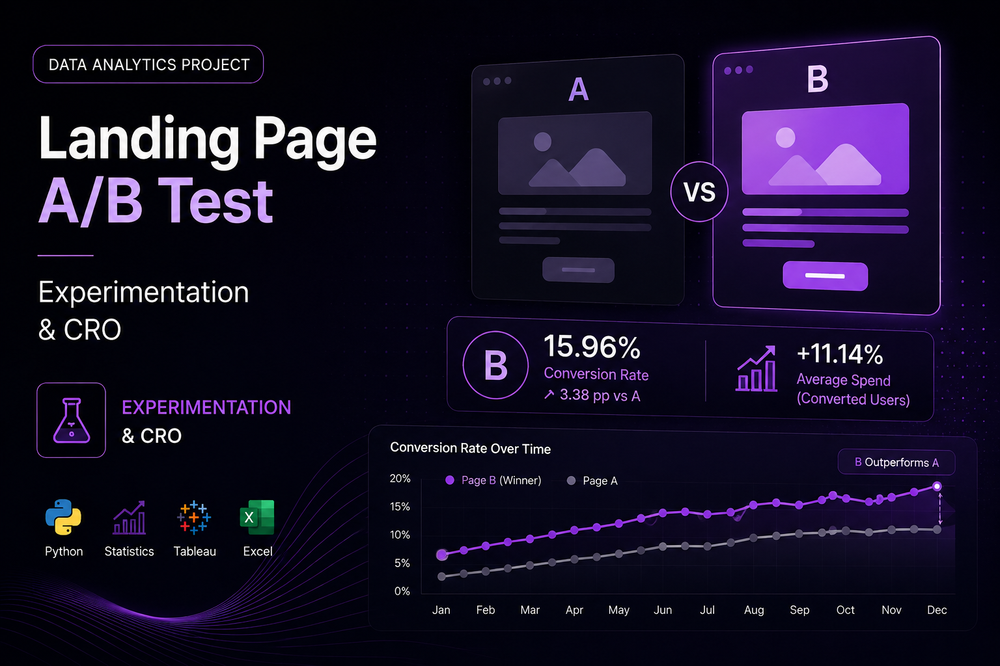

## Overview

This project evaluates an **A/B experiment on a landing page** to determine whether a new version could improve conversion performance and customer value.

Rather than comparing percentages alone, the analysis combines experimentation with statistical testing to determine whether observed differences are supported by sufficient evidence.

The project also explores how **traffic source, user type and device** are associated with conversion, translating statistical results into actionable CRO and marketing recommendations.

---

## Business Challenge

A new landing page may appear to perform better than the existing version, but observed differences do not necessarily represent real improvements.

The experiment was designed to answer several business questions:

- Does Landing Page B generate a higher conversion rate than Page A?
- Is the difference statistically significant?
- Do converted users generate different levels of spending?
- Does acquisition channel influence conversion?
- Do new and returning users behave differently?
- Does device type influence conversion performance?
- Which findings should actually influence business decisions?

---

## Experiment Data

The analysis includes:

- **40,000 users**
- **40,000 unique user IDs**
- **2 landing page variants**
- **9 variables**
- **0 missing values**
- Analysis period: **January 1–28, 2026**

The dataset includes information about:

- Landing page version
- Conversion
- Customer spending
- Traffic source
- Device
- User type
- Geographic region

---

## Analytical Approach

The experiment followed a structured workflow:

**Data → Validation → Analysis → Statistical Testing → Insight → Decision**

The statistical methodology included:

- Proportion testing
- Independent samples t-test
- Chi-Square testing
- Statistical significance analysis
- Behavioral segmentation

---

## 01 — A/B Conversion Experiment

The primary objective was to determine whether Page B improved conversion compared with the existing Page A.

### Results

**Page A**

- Users: **19,982**
- Conversions: **2,512**
- Conversion Rate: **12.57%**

**Page B**

- Users: **20,018**
- Conversions: **3,194**
- Conversion Rate: **15.96%**

### Observed Lift

Page B increased conversion by approximately:

**+3.38 percentage points**

### Statistical Result

- **z-statistic:** -9.677
- **p-value:** 3.76 × 10⁻²²
- **Significance threshold:** 0.05

The difference is statistically significant.

### Business Interpretation

Page B does not simply show a higher observed conversion rate.

The statistical evidence indicates that the difference between both versions is unlikely to be explained by random variation within the analyzed sample.

This makes Page B the strongest candidate for further implementation and validation.

---

## 02 — Customer Value

Conversion alone does not determine the business impact of an experiment.

The analysis therefore compared the average spend of converted users.

### Results

**Page A**

Average Spend: **$61.09**

**Page B**

Average Spend: **$68.75**

### Difference

Converted users exposed to Page B generated approximately:

**+11.14% higher average spend**

### Statistical Result

- **t-statistic:** -9.366
- **p-value:** 1.06 × 10⁻²⁰
- **Significance threshold:** 0.05

The difference is statistically significant.

### Business Interpretation

Page B's advantage extends beyond conversion.

Users who converted through the new experience also generated greater average value.

This suggests that the potential impact of the variant should be evaluated from two perspectives:

**Conversion + Customer Value**

---

## 03 — Traffic Source

The analysis evaluated whether acquisition source was associated with conversion.

### Conversion Performance

- **Email:** 14.99%
- **Ads:** 14.74%
- **Referral:** 13.88%
- **Organic:** 13.79%

However, conversion rate alone does not tell the entire story.

Organic generated:

**2,480 conversions**

making it the largest source of conversions by absolute volume.

### Statistical Result

- **Chi-Square:** 8.662
- **p-value:** 0.034
- **Degrees of freedom:** 3

Traffic source shows a statistically significant association with conversion.

### Business Interpretation

The analysis reveals an important distinction:

**Efficiency ≠ Volume**

Email generated the highest conversion rate, while Organic generated the greatest number of conversions because of its significantly larger traffic volume.

### Recommendation

Acquisition decisions should evaluate both:

**Conversion Efficiency + Conversion Volume**

rather than optimizing only one metric.

---

## 04 — User Type

The experiment also compared new and returning users.

### Results

**New Users**

Conversion Rate: **14.36%**

**Returning Users**

Conversion Rate: **14.09%**

The observed difference was only:

**0.27 percentage points**

### Statistical Result

- **Chi-Square:** 0.513
- **p-value:** 0.474

The relationship is **not statistically significant**.

### Business Interpretation

Although new users generated more conversions in absolute terms, they also represented a larger proportion of the dataset.

There is not enough statistical evidence to conclude that new or returning users inherently have a higher probability of conversion.

### Recommendation

Avoid building conversion strategies based exclusively on user type.

Additional behavioral variables should be considered before creating different experiences for new and returning users.

---

## 05 — Device Performance

Device type produced one of the most important behavioral findings.

### Results

**Desktop**

- Users: **15,171**
- Conversions: **2,443**
- Conversion Rate: **16.10%**

**Mobile**

- Users: **24,829**
- Conversions: **3,263**
- Conversion Rate: **13.14%**

Desktop therefore achieved approximately:

**+2.8 percentage points higher conversion**

### Statistical Result

- **Chi-Square:** 67.276
- **p-value:** < 0.001

The relationship between device and conversion is statistically significant.

### Business Interpretation

Mobile represents the majority of traffic but converts at a considerably lower rate.

This creates a particularly important optimization opportunity because improvements to the mobile experience could affect a large share of total users.

Importantly, this result demonstrates **association, not causation**.

Device type alone cannot be considered the direct cause of the conversion difference.

---

## Key Findings

The experiment generated several actionable insights:

- **Page B converted 15.96% of users compared with 12.57% for Page A.**
- The conversion difference of approximately **+3.38 percentage points is statistically significant**.
- Converted users on Page B generated **11.14% higher average spend**.
- **Email achieved the highest conversion rate at 14.99%**.
- **Organic generated the highest conversion volume with 2,480 conversions**.
- Traffic source showed a statistically significant association with conversion.
- User type did **not** show a statistically significant association with conversion.
- **Desktop converted at 16.10% compared with 13.14% on Mobile**.
- Mobile represents a significant CRO opportunity because it combines high traffic volume with lower conversion performance.

---

## Strategic Recommendations

### Prioritize Page B

Page B demonstrates statistically significant improvements in both conversion and average spend.

However, a full rollout should also consider:

- Implementation costs
- Maintenance costs
- Expected incremental revenue
- Potential ROI
- Sustainability outside the experiment

### Investigate Mobile Friction

The Mobile experience should receive particular attention.

Potential areas for investigation include:

- Page speed
- Navigation
- Form usability
- CTA placement
- Funnel abandonment
- Mobile-specific A/B experiments

### Balance Acquisition Efficiency and Scale

Email demonstrates stronger conversion efficiency, while Organic generates significantly more total conversions.

Channel strategy should therefore balance:

**Efficiency + Scale**

### Avoid Unsupported Segmentation

Because user type was not significantly associated with conversion, there is insufficient evidence to prioritize different experiences based only on whether a user is new or returning.

---

## Tools & Technologies

- **Python**
- **Pandas**
- **NumPy**
- **SciPy**
- **Statsmodels**
- **Matplotlib**
- **Seaborn**
- **A/B Testing**
- **Proportion Testing**
- **Independent Samples t-test**
- **Chi-Square Testing**
- **Statistical Inference**
- **Conversion Rate Optimization**
- **Marketing Analytics**

---

## What This Project Demonstrates

This project demonstrates my ability to use **experimentation and statistical analysis to support marketing and product decisions**.

The analysis goes beyond identifying which variant generated the highest percentage.

It evaluates whether the observed differences are statistically supported, explores customer behavior across multiple dimensions and translates the results into actionable recommendations.

The analytical process can be summarized as:

**Hypothesis → Experiment → Evidence → Insight → Decision**

This approach helps ensure that optimization decisions are based on evidence rather than assumptions.

---

## Repository

<a href="https://github.com/josuemayoral-cell/Experimento_Landing_Test_A-B" target="_blank" rel="noopener noreferrer">
View Landing Page A/B Experiment on GitHub
</a>