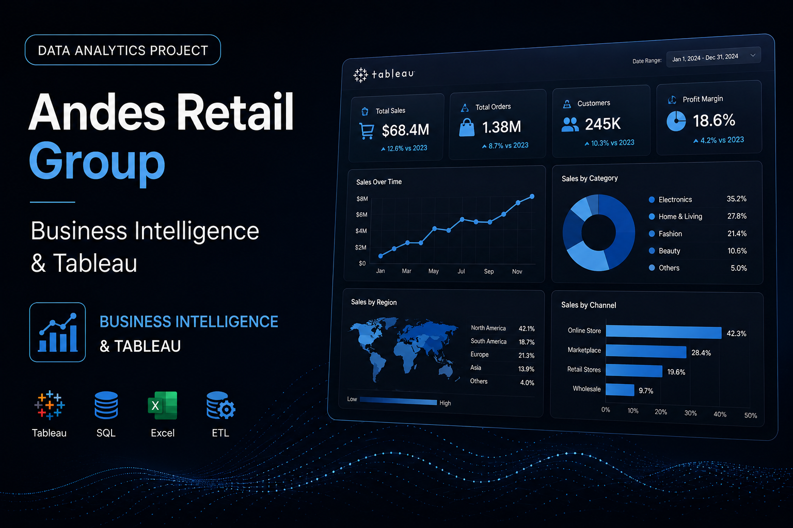

## Overview

Andes Retail Group is a **Business Intelligence and Commercial Analytics project** focused on evaluating business performance across 2024 and 2025.

The project transforms transactional data into an executive Tableau dashboard designed to analyze **revenue, profitability, customer value, geographic performance, product categories and seasonality**.

The objective was not simply to visualize historical data, but to understand:

**Where is the business generating value, what is driving commercial performance, and where should the company focus its efforts next?**

---

## Business Challenge

A business can remain profitable while simultaneously experiencing declining sales, changing customer behavior or seasonal volatility.

Looking only at total revenue can therefore hide important commercial patterns.

This project was designed to answer questions such as:

- How profitable is the operation?
- How did commercial performance change between 2024 and 2025?
- Which countries generate the most revenue?
- Which customer segments create the most value?
- Which product categories perform best?
- How strongly does seasonality influence sales?
- Where are the clearest commercial optimization opportunities?

---

## Data & Analytical Approach

The analysis was built from a transactional dataset containing:

- **5,000 orders**
- **3,821 unique customers**
- **3 countries**
- **3 regions**
- **3 customer segments**
- **4 product categories**
- **4 seasons**
- Analysis period: **January 2024 – December 2025**

The project followed a Business Intelligence workflow:

1. Data validation
2. KPI definition
3. Tableau calculated fields
4. Year-over-year performance analysis
5. Geographic analysis
6. Customer segmentation
7. Product category analysis
8. Seasonality analysis
9. Dashboard development
10. Business interpretation and recommendations

The analytical framework can be summarized as:

**Data → KPIs → Patterns → Insights → Decisions**

---

## 01 — Overall Commercial Performance

The analyzed operation generated approximately:

**$5.53M in total revenue**

with:

**$3.59M in total costs**

resulting in an estimated:

**$1.94M in profit**

and an overall profit margin of:

**35.10%**

Additional business KPIs included:

- **5,000 orders**
- **57,601 units sold**
- **$1,106.40 average revenue per order**
- **$96.38 average unit price**

### Business Interpretation

The business maintains healthy positive profitability.

However, aggregate profitability alone does not reveal whether commercial performance is improving or deteriorating over time.

This made the year-over-year comparison a critical next step.

---

## 02 — 2024 vs. 2025 Performance

Revenue evolved as follows:

**2024**

$2.86M

**2025**

$2.67M

This represents an approximate:

**-6.80% year-over-year decline**

Order volume also decreased:

- **2024:** 2,550 orders
- **2025:** 2,450 orders

### Business Interpretation

Although the operation remains profitable, both revenue and order volume declined in 2025.

This indicates commercial deceleration.

The main business question therefore becomes:

**Which dimensions are contributing most to the decline?**

---

## 03 — Geographic Performance

Revenue by country was distributed as follows:

**Peru**

$2.16M

**Chile**

$2.03M

**Colombia**

$1.35M

### Key Finding

**Peru is the highest-revenue market**, followed closely by Chile.

However, all three countries generated lower revenue in 2025 compared with 2024.

### Business Interpretation

Because the decline appears across multiple markets, the slowdown does not seem to be isolated to a single country.

This suggests that broader factors such as seasonality, customer behavior or commercial mix may also be influencing performance.

### Recommendation

Analyze the decline through:

**Country → Customer Segment → Product Category → Season**

to identify where the slowdown is concentrated.

---

## 04 — Customer Segmentation

Revenue by customer segment:

**Premium**

$2.60M

**Standard**

$2.44M

**Economy**

$0.50M

### Key Finding

The **Premium segment generates the highest revenue**, even though the Standard segment contributes more transactions.

### Business Interpretation

Customer volume and customer value are not the same.

Premium customers represent a high-value segment that could support stronger commercial performance through retention and expansion strategies.

### Recommendation

Develop differentiated initiatives for Premium customers focused on:

- Retention
- Personalized communication
- Upselling
- Cross-selling
- Customer Lifetime Value
- Behavior-based offers

---

## 05 — Product Category Performance

Revenue by product category:

**Sports**

$1.44M

**Electronics**

$1.41M

**Home**

$1.36M

**Clothing**

$1.32M

### Key Finding

**Sports generated the highest revenue**, although the four categories show relatively balanced performance.

### Business Interpretation

The company does not show extreme dependence on a single category.

This reduces concentration risk and suggests that commercial decisions should evaluate not only revenue, but also:

- Profitability
- Seasonality
- Customer segment
- Geographic performance

---

## 06 — Seasonality

Seasonality produced one of the strongest patterns identified in the analysis.

Revenue by season:

**Summer**

$2.24M

**Fall**

$1.34M

**Spring**

$1.29M

**Winter**

$0.65M

### Key Finding

**Summer generates more than three times the revenue observed during Winter.**

### Business Interpretation

Seasonality has a substantial impact on commercial performance.

Lower winter revenue should therefore not automatically be interpreted as a product, customer or geographic problem without first considering the seasonal effect.

### Recommendation

Develop a specific commercial strategy for lower-demand periods through:

- Seasonal campaigns
- Targeted promotions
- Inventory adjustments
- Premium customer activation
- Bundling
- Cross-selling
- Early commercial planning before Winter

---

## Key Findings

The analysis identified several important commercial patterns:

- The operation generated approximately **$5.53M in revenue**.
- Estimated profit reached approximately **$1.94M**.
- Overall profit margin was approximately **35.10%**.
- Revenue declined approximately **6.80% in 2025 compared with 2024**.
- **Peru generated the highest revenue at approximately $2.16M**.
- The **Premium segment generated approximately $2.60M**, making it the highest-value customer segment.
- **Sports was the leading category at approximately $1.44M**.
- Seasonality represents one of the strongest patterns in the business, with **$2.24M in Summer compared with $0.65M in Winter**.
- The year-over-year slowdown appears across multiple geographic markets, suggesting that the decline should be investigated through multiple commercial dimensions rather than a single KPI.

---

## Strategic Recommendations

### Investigate the Year-over-Year Decline

Break down the 2025 decline through:

**Country → Segment → Category → Season**

to identify where the slowdown is concentrated.

### Prioritize High-Value Customers

Develop retention, personalization, upselling and cross-selling initiatives for Premium customers.

### Build a Seasonal Commercial Strategy

Use the strong seasonal pattern to plan campaigns, inventory and customer activation before lower-demand periods.

### Protect Core Markets

Maintain Peru and Chile as priority markets while evaluating opportunities to improve Colombia's contribution.

### Evaluate Profitability Beyond Revenue

Commercial decisions should combine:

**Revenue + Costs + Margin + Volume**

rather than relying only on total sales.

---

## Tableau Dashboard

The project was developed as an interactive Tableau workbook with three main dashboards:

### Executive Overview

High-level view of the main commercial KPIs.

### Commercial Performance 24–25

Comparison of business performance across 2024 and 2025.

### Detailed Analysis

Exploration of results by:

- Country
- Region
- Customer segment
- Product category
- Seasonality

The dashboard was designed to support both executive monitoring and deeper commercial exploration.

---

## Calculated Fields

The Tableau workbook includes calculated fields used to generate additional business indicators.

### Profit

```text
Revenue - Cost
```

### Profit Margin

```text
(SUM(Revenue) - SUM(Cost)) / SUM(Revenue) * 100
```

The dashboard also includes sales classification logic to differentiate higher- and lower-value transactions.

---

## Tools & Technologies

- **Tableau**
- **Microsoft Excel**
- **Business Intelligence**
- **Commercial Analytics**
- **Sales Analytics**
- **Dashboard Design**
- **KPI Development**
- **Data Visualization**
- **Customer Segmentation**
- **Geographic Analysis**
- **Seasonality Analysis**
- **Profitability Analysis**
- **Calculated Fields**

---

## What This Project Demonstrates

This project demonstrates my ability to transform transactional data into a **Business Intelligence solution designed to support commercial decision-making**.

The objective was not simply to build a dashboard.

The analysis connects business KPIs with customer behavior, geography, product performance and seasonality to identify where the company generates value and where commercial opportunities or risks exist.

The process can be summarized as:

**Data → KPIs → Patterns → Insights → Decisions**

This allows the dashboard to move beyond reporting and become a tool for **commercial prioritization, performance monitoring and strategic decision-making**.

---

## Repository

<a href="https://github.com/josuemayoral-cell/Desempen-o-Comercial-2024-2025-Andes-Retail-Group" target="_blank" rel="noopener noreferrer">
View Andes Retail Group Project on GitHub
</a>