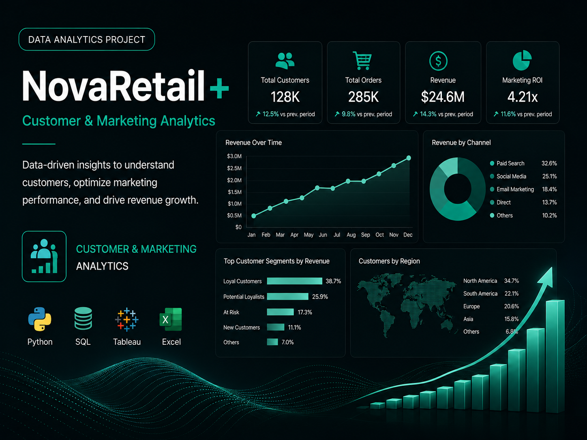
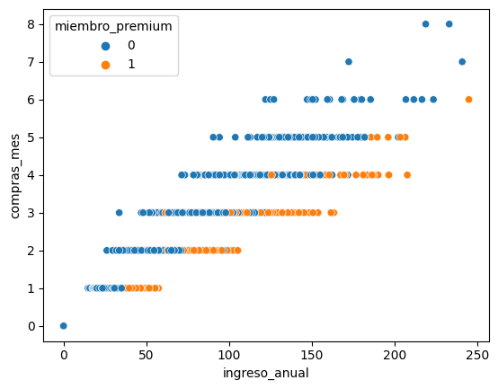
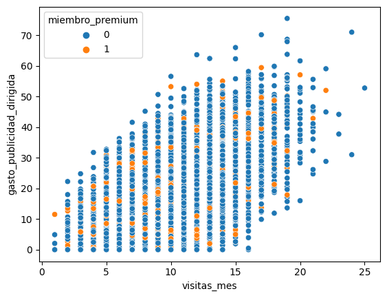
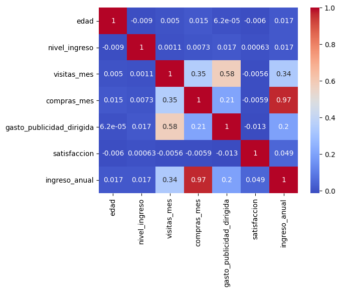

## Overview

NovaRetail+ is a **Customer & Marketing Analytics project** focused on understanding how customer behavior relates to engagement, purchasing activity and revenue generation.

The analysis explores behavioral data from **15,000 customers** and combines exploratory analysis, segmentation and statistical methods to identify patterns related to:

- Customer value
- Purchase frequency
- Engagement
- Targeted advertising
- Premium membership
- Churn
- Device behavior
- Geographic differences

The objective was not simply to describe customer behavior, but to answer a broader business question:

**Which customer behaviors are most strongly associated with value, and how can those insights support better marketing and retention decisions?**

---

## Business Challenge

Customer databases contain multiple behavioral signals, but not every relationship is equally meaningful for the business.

High engagement does not necessarily mean high customer value, and statistical relationships do not automatically imply causality.

This project was designed to explore questions such as:

- Which behaviors are most strongly associated with customer-generated revenue?
- Does purchase frequency help identify high-value customers?
- Is targeted advertising associated with customer engagement?
- Does Premium membership meaningfully differentiate customer value?
- Does device preference vary by geographic region?
- Which customer groups represent potential reactivation opportunities?
- Which findings should become hypotheses for future experimentation?

---

## Data & Analytical Approach

The analysis was built from a dataset containing:

- **15,000 customers**
- **12 variables**
- **0 missing values**
- Analysis period: **2024**

The dataset includes information related to:

- Customer age
- Income level
- Monthly visits
- Monthly purchases
- Targeted advertising spend
- Customer satisfaction
- Premium membership
- Churn
- Device type
- Geographic region
- Annual revenue generated

The analytical process included:

1. Data validation
2. Exploratory Data Analysis
3. Descriptive statistics
4. Customer segmentation
5. Correlation analysis
6. Behavioral visualization
7. Pearson and Spearman correlations
8. Point-biserial correlation
9. Chi-Square analysis
10. Cramér's V
11. Business interpretation
12. Development of actionable hypotheses

The analytical framework can be summarized as:

**Data → Behavior → Evidence → Insight → Business Decision**

---

## 01 — Purchase Frequency & Customer Value

One of the strongest relationships identified in the analysis was between:

**Monthly Purchases ↔ Annual Revenue**

### Statistical Evidence

Correlation:

**0.9675**

### Business Interpretation

Customers who purchase more frequently tend to generate substantially higher annual revenue.

This makes purchase frequency an important behavioral signal for identifying potentially high-value customers.

However, the relationship should not be interpreted as causal.

Increasing purchase frequency artificially would not necessarily generate an equivalent increase in customer value.

### Behavioral Evidence



*Customer-level relationship between purchase frequency and annual revenue, supporting the high-value customer segmentation hypothesis.*

### Recommendation

Use purchase frequency as one dimension within customer segmentation strategies focused on:

- High-value customers
- Loyalty
- Cross-selling
- Personalized recommendations
- Reactivation
- Customer Lifetime Value

---

## 02 — Advertising & Customer Engagement

The analysis also identified a relationship between:

**Monthly Visits ↔ Targeted Advertising Spend**

### Statistical Evidence

Correlation:

**0.5593**

### Business Interpretation

Customers receiving greater targeted advertising investment also tend to visit the platform more frequently.

However, the direction of this relationship cannot be determined from correlation alone.

Two explanations remain possible:

**Advertising → Higher Engagement**

or:

**Higher Engagement → Greater Advertising Investment**

### Advertising & Engagement Visualization



*Observed association between monthly visits and targeted advertising spend. The visualization supports exploration, while the project explicitly avoids interpreting correlation as causation.*

### Correlation Overview



*Correlation matrix used to prioritize the relationships that warranted deeper statistical and business interpretation.*

### Recommendation

Evaluate the complete commercial path:

**Advertising → Visits → Purchases → Revenue**

This would help determine whether advertising investment is associated only with engagement or also with measurable customer value.

---

## 03 — Premium Membership

Premium customers represent approximately:

**13.93% of the customer base**

The analysis evaluated whether Premium membership showed a meaningful statistical relationship with customer behavior.

### Statistical Evidence

Point-biserial correlation:

**0.0931**

with:

**p-value < 0.001**

### Business Interpretation

The relationship is statistically significant, but its magnitude is very small.

This distinction is important:

**Statistical significance ≠ Business significance**

Premium membership alone therefore appears insufficient to explain substantial differences in customer value.

### Recommendation

Evaluate Premium customers while controlling for:

- Purchase frequency
- Revenue
- Visits
- Satisfaction
- Advertising exposure
- Churn

This would help determine whether Premium membership generates incremental value beyond the behavior customers already demonstrate.

---

## 04 — Mobile Customer Behavior

Approximately:

**65% of customers use Mobile**

making it the primary access point to NovaRetail+.

### Business Interpretation

Mobile represents the company's largest digital customer touchpoint.

However, traffic volume alone does not demonstrate that Mobile generates the strongest customer experience or commercial performance.

### Recommendation

Evaluate Mobile against Desktop and Tablet using:

- Revenue per customer
- Purchases per customer
- Engagement
- Satisfaction
- Churn
- Conversion-related metrics

This would help determine whether Mobile represents both the largest and most valuable customer experience.

---

## 05 — Device & Geographic Region

Because Mobile dominates the customer base, the analysis explored whether device preference was related to geographic region.

### Statistical Evidence

Cramér's V:

**0.0124**

### Business Interpretation

The association between device and geographic region is practically nonexistent.

Mobile dominance therefore appears to be a cross-regional behavior rather than a pattern driven by one particular market.

### Recommendation

Avoid creating regional strategies based solely on assumed device differences.

Region and device should instead be evaluated independently alongside customer value and behavioral metrics.

---

## 06 — Reactivation Opportunity

Approximately:

**25% of customers generated zero annual revenue**

during the analyzed period.

### Business Interpretation

This represents a meaningful customer segment that exists within the database but did not generate economic value during the year.

Instead of treating these customers as a single inactive group, their behavior can be analyzed through:

- Visits
- Advertising exposure
- Satisfaction
- Premium membership
- Device
- Region
- Engagement

### Recommendation

Create a dedicated zero-revenue segment and compare its behavioral profile against revenue-generating customers.

The objective would be to identify potential audiences for targeted reactivation strategies.

---

## Key Findings

The analysis identified several relevant customer patterns:

- **Monthly purchases and annual revenue show a very strong positive correlation of 0.9675**.
- Purchase frequency represents a valuable behavioral signal for customer-value segmentation.
- **Monthly visits and targeted advertising spend show a moderate correlation of 0.5593**.
- Premium members represent approximately **13.93% of customers**.
- Premium membership showed a statistically significant but weak relationship of **0.0931** in the evaluated analysis.
- Approximately **65% of customers use Mobile**, making it the primary digital touchpoint.
- Device and geographic region show virtually no association, with a **Cramér's V of 0.0124**.
- Approximately **25% of customers generated no annual revenue**, creating a potential reactivation opportunity.

---

## Strategic Recommendations

### Segment Customers by Behavior and Value

Combine:

**Purchase Frequency + Revenue + Engagement + Membership**

to identify high-value and growth-potential customer groups.

### Evaluate Premium Incremental Value

Determine whether Premium membership produces additional value after controlling for existing customer behavior.

### Connect Advertising to Business Outcomes

Move beyond visits and evaluate:

**Advertising → Engagement → Purchase → Revenue**

to better understand marketing efficiency.

### Develop Reactivation Segments

Analyze zero-revenue customers according to their engagement and behavioral characteristics before designing reactivation campaigns.

### Prioritize Mobile Analysis

Because Mobile represents the majority of customers, investigate whether its commercial performance matches its traffic dominance.

### Validate Insights Through Experimentation

Use the identified statistical relationships to generate hypotheses for:

- A/B testing
- Controlled experiments
- Cohort analysis
- Longitudinal analysis

---

## Statistical Methods

The project uses multiple statistical techniques depending on the type of variables being evaluated.

### Pearson / Spearman Correlation

Used to evaluate relationships between numerical variables.

**Purchases vs. Annual Revenue**

```text
Correlation = 0.967482
```

**Visits vs. Targeted Advertising**

```text
Correlation = 0.559267
```

### Point-Biserial Correlation

Used to evaluate relationships between binary and numerical variables.

```text
Correlation = 0.0931
p-value < 0.001
```

### Cramér's V

Used to evaluate association between categorical variables.

**Device vs. Region**

```text
Cramér's V = 0.012378
```

A central principle throughout the analysis was:

**Correlation ≠ Causation**

Statistical relationships were therefore interpreted as evidence for generating business hypotheses rather than proof of causal effects.

---

## Tools & Technologies

- **Python**
- **Pandas**
- **NumPy**
- **SciPy**
- **Matplotlib**
- **Seaborn**
- **Exploratory Data Analysis**
- **Customer Analytics**
- **Marketing Analytics**
- **Customer Segmentation**
- **Correlation Analysis**
- **Statistical Inference**
- **Behavioral Analysis**
- **Retention Analysis**

---

## What This Project Demonstrates

This project demonstrates my ability to combine **customer analytics, statistical analysis and marketing thinking** to transform behavioral data into actionable business hypotheses.

Rather than focusing only on descriptive metrics, the analysis investigates relationships between customer behavior and economic value while distinguishing between **statistical significance, business relevance and causality**.

The analytical process can be summarized as:

**Behavior → Evidence → Insight → Hypothesis → Decision**

This approach supports better decisions around **customer segmentation, advertising efficiency, Premium membership, retention, reactivation and experimentation**.

---

## Repository

<a href="https://github.com/josuemayoral-cell/NovaRetail---analysis" target="_blank" rel="noopener noreferrer">
View NovaRetail+ Project on GitHub
</a>