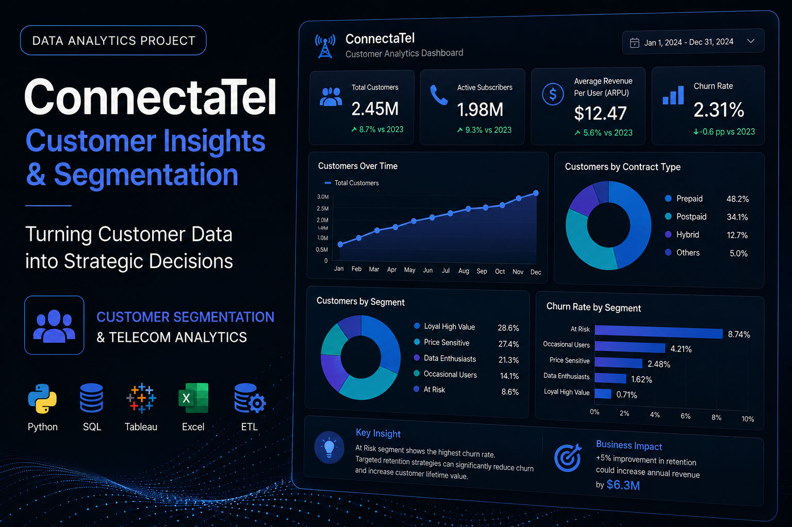

## Overview

ConnectaTel is a **Customer Analytics and Behavioral Segmentation project** focused on understanding how telecom customers use calls and messaging services.

The analysis combines customer, plan and usage data to transform **40,000 activity records from 4,000 customers** into behavioral profiles that can support commercial decisions.

The main business question was:

**How can actual customer behavior be used to improve segmentation, plan strategy and commercial opportunities?**

---

## Business Challenge

Traditional customer segmentation based only on the contracted plan may overlook important differences in actual usage.

Two customers subscribed to the same plan can have completely different consumption patterns and commercial needs.

The project therefore explored:

- Customer usage behavior
- Basic vs. Premium distribution
- High-consumption customers
- Behavioral segmentation
- Differences across age groups
- Potential upselling opportunities

---

## Data & Analytical Approach

The project integrates three datasets containing:

- **4,000 customers**
- **40,000 activity records**
- Customer demographics
- Plan information
- Calls and messages
- Usage duration

The analytical workflow was:

**Data Cleaning → Aggregation → EDA → Segmentation → Insights → Recommendations**

The analysis included data-quality validation, dataset integration, customer-level aggregation, descriptive statistics, IQR-based outlier detection and behavioral segmentation.

---

## 01 — Customer Usage

Average usage per customer:

- **5.52 messages**
- **4.48 calls**
- **23.32 call minutes**

Activity distribution:

- **55.23% Text**
- **44.77% Calls**

### Business Interpretation

Both services remain relevant within the analyzed customer base, with messaging representing the largest share of recorded activity.

---

## 02 — Plan Distribution

Customer distribution:

**Basic**

64.88%

**Premium**

35.12%

### Key Finding

Nearly **2 out of every 3 customers use the Basic plan**.

This makes the Basic customer base particularly important for identifying users whose actual consumption may indicate opportunities for migration or upselling.

---

## 03 — High-Usage Customers

The IQR method was used to identify unusually high consumption levels.

Upper thresholds:

```text
Messages → 11.5
Calls → 10.5
Minutes → 61.86
```

These observations were preserved rather than automatically removed because they may represent legitimate high-value behavioral patterns.

### Business Interpretation

High-usage customers could represent opportunities for:

- Upselling
- Specialized plans
- Add-ons
- Personalized offers

---

## 04 — Behavioral Segmentation

Customers were classified into:

**Low Usage → Medium Usage → High Usage**

based on their calling and messaging behavior.

### Business Interpretation

This allows segmentation to move beyond the customer's current subscription.

Instead of relying only on:

**Basic vs. Premium**

the company can incorporate:

**Plan + Actual Usage**

to build more meaningful customer segments.

---

## 05 — Age Segmentation

Customers were divided into:

- **Young (<30): 19.0%**
- **Adults (30–59): 50.5%**
- **Older Adults (60+): 30.6%**

### Key Finding

Adults represent approximately half of the customer base.

However, average usage levels were relatively similar across age groups.

### Business Interpretation

Age alone does not appear sufficient to explain major differences in customer consumption.

Behavior should therefore remain the primary segmentation signal, with demographics used as complementary information.

---

## Key Findings

- **64.88% of customers use the Basic plan.**
- Customers average **5.52 messages, 4.48 calls and 23.32 call minutes**.
- Messaging represents **55.23% of recorded activity**.
- High-consumption customers were identified through IQR rather than automatically removed as outliers.
- Adults aged 30–59 represent approximately **50.5% of customers**.
- Usage patterns remain relatively similar across age groups.
- Behavioral data provides an opportunity to improve segmentation beyond plan type alone.

---

## Strategic Recommendations

### Identify High-Usage Basic Customers

Use behavioral data to identify Basic customers whose consumption could justify Premium migration or additional services.

### Segment by Actual Behavior

Combine:

**Plan + Usage Level + Customer Profile**

instead of relying exclusively on subscription type.

### Develop Offers for Intensive Users

Test specialized plans, add-ons or personalized offers for customers with unusually high usage.

### Evaluate Premium Value

Connect usage with revenue, churn and profitability to determine whether Premium generates incremental customer and business value.

### Validate Through Experimentation

Use A/B testing and controlled commercial experiments before implementing new plan structures or offers at scale.

---

## Tools & Technologies

- **Python**
- **Pandas**
- **NumPy**
- **Matplotlib**
- **Seaborn**
- **Exploratory Data Analysis**
- **Data Cleaning**
- **Data Aggregation**
- **IQR Outlier Detection**
- **Customer Segmentation**
- **Customer Analytics**
- **Telecom Analytics**

---

## What This Project Demonstrates

This project demonstrates my ability to transform raw customer activity into **behavioral segments and commercially actionable insights**.

The analysis combines data cleaning, multiple-dataset integration, feature aggregation and customer segmentation to connect technical analysis with business decisions.

The process can be summarized as:

**Raw Data → Customer Behavior → Segmentation → Insight → Commercial Opportunity**

---

## Repository

<a href="https://github.com/josuemayoral-cell/connectatel-analysis" target="_blank" rel="noopener noreferrer">
View ConnectaTel Project on GitHub
</a>